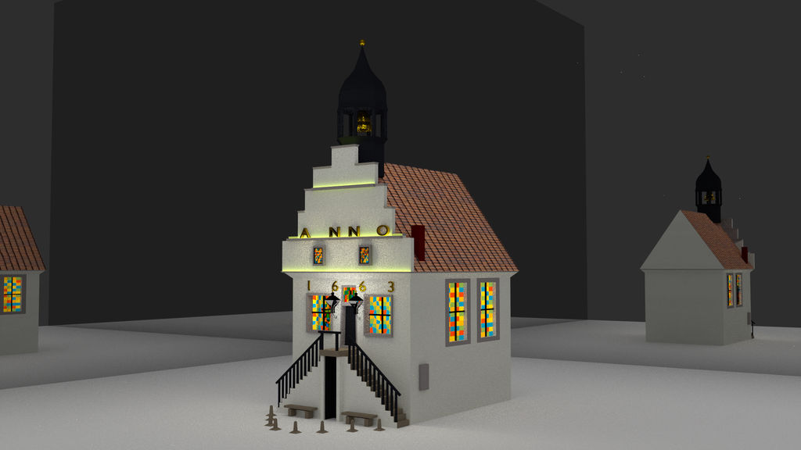

Vor einigen Jahren habe ich mich an Blender versucht und es irgendwann zugunsten meiner Schulbildung wieder vernachlässigt. Nun ist die Zeit gekommen, um wieder auf den Zug aufzuspringen. Ich habe die Zeit, das Interesse und es hat sich sehr viel bei Blender getan. Doch zuerst möchte ich auf meine früheren Erzeugnisse eingehen.

Folgend sind meine guten drei Bilder von meinen anfänglichen Schritten bis zum größten Werk, dass ich damals erschaffen habe, gezeigt.

Zum Schluss habe ich sehr viel Zeit investiert; Fünfzig Stunden, so schätze ich. 

## Neu entdecken

Nun habe ich angefangen Blender neu zu entdecken. Es gibt viele tolle neue Features. Mein Blender-Projekt *Donut* sieht gerade so aus:

Der Donut ist schon durch einige Schritte gegangen:

Ich bin gespannt, wie es weitergeht.
