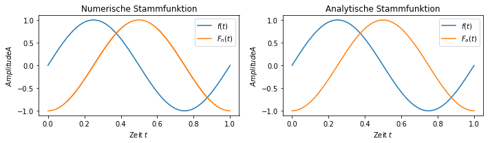

In der Vorlesung *Digitale Signalverarbeitung* gab es die Aufgabe eine Funktion für die numerische Berechnung der Stammfunktion zu schreiben. Das ist das, womit ich geendet habe:

```python
def integrate(x: [], f: [], dx: float) -> []:
    '''
    Die Integrierfunktion gibt für eine gegebene Funktion die über 
    numerische Schritte dx integrierte Flächenfunktion zurück.
    
    Parameters
    ----------
    x : []
        Eingabewerte der Funktion f(x)
    f : []
        Funktionswerte der Funktion f(x)
    dx : float
        "infinitesimal" kleiner Schritt dx. 
        0 < dx <= 1 --> dx = (b-a)/N | ∀ x ∈ [a,b]
    
    Returns
    -------
    F[x]
        Numerische Stammfunktion
    '''
    if not 0 < dx <= 1:
        raise ValueError("'dx' must be between 0 and 1")
    
    step_size = np.round( int(dx * len(f)) )    # dx = (b-a)/N
    distance = x[step_size] - x[0]              # ∆x = (x - x0)
    steps = range(1, len(f)-1, step_size)
    # ersten Wert für ersten Durchlauf der Schleife einfügen
    F_C = [ f[0] ]
    
    for step in steps:
        area = distance * f[step]
        for _ in range(step_size):
            F_C.append(F_C[step-1] + area)
        
    # erster Wert ist f[0] und nicht integriert, also raus damit
    F_C = F_C[1:len(F_C)]
    # Integrationskonstante C abziehen
    C = np.mean(F_C)
    F = F_C - C
        
    return F
```

Die Verwendung der Funktion ist ja bereits im Docstring erklärt, daher möchte ich an dieser Stelle lieber mehr auf den Algorithmus eingehen, der die numerische Stammfunktion berechnet. 

In einem ersten Schritt werden die zur Berechnung erforderlichen Werte ermittelt:

* Indexbasierte Schrittweite (`step_size`)
* Wertabstand der Funktionswerte (`distance`)
* Indizes im korrekten Schrittabstand (`steps`)
* Wertemenge für bestimmtes Integral  (`F_C`)

Die Wertemenge `F_C` enthält bereits ein Element, auf das der folgende Algorithmus zurückgreifen kann. Ansonsten müsste der Algorithmus eine Fallunterscheidung für das erste Element treffen. 

Nun wird mithilfe der Indizes `steps` die Fläche unter der Funktion ermittelt. Da der Wertabstand `distance` für jeden Schritt konstant ist, muss dieser nicht im jeden Schleifendurchlauf erneut berechnet werden. Für jeden Durchlauf werden zur Kompensierung der vergleichsweise *groben* Diskretisierung die Wertemenge `F_C` mit den eben berechneten Werten zum nächsten Index `step` aufgefüllt. Das führt zu den Sprüngen bei niedrigen Auflösungen. 

$$
\int f(x) = F(x) + C
$$

Da der erste Wert vorher zur Vereinfachung des Algorithmus hingefügt wurde, wird dieser wieder entfernt. Nachfolgend wird die Integrationskonstante `C` abgezogen, da die Stammfunktion ermittelt werden soll. Die Integrationskonstante ist der *Gleichanteil* des Signals, wenn man so möchte. 

Damit steht jetzt eine Funktion zur Ermittlung der Stammfunktion zur Verfügung. Im Folgenden Bild ist eine Sinusfunktion und die numerische und die analytische Stammfunktion abgebildet.


$$
\int \sin(\omega t) = -\cos (\omega t) +C
$$


